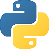

# Ejercicios de apoyo para curso en Python 3
## Bienvenido al Repositorio 🚀

_Este repositorio se basa en una serie de ejercicios en Python 3
como complemento al curso realizado en Udemy._

_Estos ejercicios están incluidos en la carpeta  /tests_

## Autor ✒️

_Único autor del repositorio_

* **fran-byte** -

## Licencia 📄

Este proyecto está bajo Licencia MIT

---

# Support exercises for course in Python 3
## Welcome to the repository 🚀

_This repository is based on a series of exercises in Python 3
 as a complement to the course in Udemy._

_These exercises are included in the folder / tests_

## Author ✒️

_Unique author of the repository_

* **fran-byte** -

## License 📄

This project is under the MIT License

